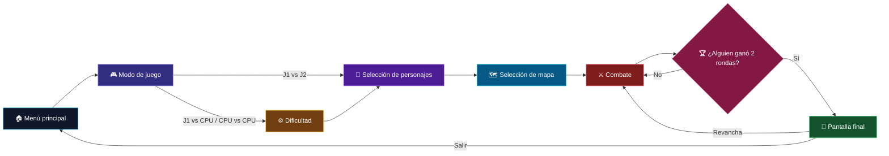

<div align="center">


# ⚔️ INTESUD FIGHTER ⚔️

### ¡Elige a tu luchador, domina el escenario y demuestra quién manda!


</div>

---

## 🔥 ¿Qué es Intesud Fighter?

**Intesud Fighter** es un juego de lucha 2D local desarrollado en Unity. Dos combatientes se enfrentan en escenarios de estilo pixel art usando movimiento lateral, saltos, doble salto y ataques cuerpo a cuerpo.

El juego permite luchar contra otra persona, enfrentarse a una CPU o ver un combate automático entre dos CPU. Cada partida combina selección de modo, dificultad, personajes y escenario.

> 🟥 **Objetivo:** reduce la vida de tu rival a cero antes de que termine el tiempo y gana dos rondas para llevarte el combate.

## 🎮 Modos de juego

| Modo | Descripción |
|:--|:--|
| 🟦 **Jugador 1 vs Jugador 2** | Dos jugadores compiten en el mismo equipo con teclado o mandos. |
| 🟪 **Jugador 1 vs CPU** | Un jugador se enfrenta a un rival controlado por inteligencia artificial. |
| 🟥 **CPU vs CPU** | Dos luchadores controlados por el juego combaten entre sí. |

Cuando participa una CPU se puede elegir entre tres niveles:

- 🟢 **Fácil:** decisiones más lentas, menor presión y menos ataques.
- 🟡 **Medio:** comportamiento equilibrado y mayor capacidad de reacción.
- 🔴 **Difícil:** movimientos rápidos, presión constante, evasión y ataques más frecuentes.

## 🧭 Flujo del juego



Cada luchador comienza la ronda con **100 puntos de vida**. El reloj parte de **99 segundos**. Si el tiempo llega a cero, gana quien conserve más vida; si ambos tienen la misma cantidad, la ronda termina en empate. El primer combatiente que consiga **dos rondas** gana la partida.

## ⌨️ Controles de teclado

Los controles de combate pueden modificarse desde las opciones del juego. Esta es la configuración predeterminada:

| Acción | 🔵 Jugador 1 | 🔴 Jugador 2 |
|:--|:--:|:--:|
| Mover a la izquierda | `A` | `←` |
| Mover a la derecha | `D` | `→` |
| Saltar / doble salto | `W` | `↑` |
| Atacar | `F` | `M` |

### Navegación por menús

| Acción | Teclado |
|:--|:--|
| Navegar | `W` / `S`, flechas o `A` / `D`, según la pantalla |
| Confirmar | `Enter` o `Espacio` |
| Volver | `Esc` |

En la selección de personajes, el Jugador 1 navega con `WASD` y confirma con `F`; el Jugador 2 navega con las flechas y confirma con `Enter`.

## 🎮 Controles con mando

El proyecto admite hasta dos mandos y asigna uno a cada jugador.

| Acción | Mando |
|:--|:--|
| Mover / navegar | Stick izquierdo o cruceta |
| Saltar / confirmar | Botón sur — `✕` en PlayStation / `A` en Xbox |
| Atacar | Botón oeste — `□` en PlayStation / `X` en Xbox |
| Volver / cancelar | Botón este — `○` en PlayStation / `B` en Xbox |

> 💡 Durante el combate puedes saltar una segunda vez en el aire para ejecutar un **doble salto**.

## 🛠️ Cómo abrir el proyecto

### Requisitos

- **Unity 6**, versión recomendada: `6000.4.8f1`.
- Git.
- Windows, macOS o Linux compatible con esa versión de Unity.

### Instalación

```bash
git clone https://github.com/Dandres1700/Intesud_Fighter.git
cd Intesud_Fighter
```

Después:

1. Abre **Unity Hub**.
2. Selecciona **Add project from disk**.
3. Elige la carpeta clonada.
4. Abre el proyecto con Unity `6000.4.8f1`.
5. Espera a que Unity restaure los paquetes e importe los recursos.
6. Abre `Assets/Scenes/MenuPrincipal.unity` y presiona **Play**.

## 🧱 Estructura principal

```text
Assets/
├── Animations/       # Animaciones y controladores de luchadores
├── Audio/            # Música y efectos de sonido
├── Prefabs/          # Objetos reutilizables del juego
├── Scenes/           # Menús, selecciones y combate
├── Scripts/          # Lógica, controles, CPU y flujo
├── Texture/          # Fondos y recursos visuales
└── UI/               # Interfaz y botones
Packages/             # Dependencias del proyecto
ProjectSettings/      # Configuración de Unity
```

## ✨ Características

- Combate local para uno o dos jugadores.
- Tres modos de juego y tres dificultades de CPU.
- Selección independiente de personajes.
- Selección de escenarios con música propia.
- Vida, temporizador y sistema de rondas.
- Movimiento, ataque, salto y doble salto.
- Teclas configurables guardadas mediante `PlayerPrefs`.
- Soporte para teclado, ratón y hasta dos mandos.
- Música, efectos de sonido, partículas y animaciones.

## 🙌 Agradecimientos

Gracias a:

- **Unity Technologies**, por el motor y sus herramientas.
- Las personas creadoras de los paquetes de interfaz, tipografías, música, efectos, sprites y recursos visuales utilizados en el proyecto.
- Las comunidades de Unity y desarrollo de videojuegos, cuya documentación y conocimiento compartido hacen posible seguir aprendiendo.
- Todas las personas que prueban el juego y aportan sugerencias para mejorarlo.

Los recursos de terceros conservan los créditos y términos indicados en sus respectivos archivos de licencia dentro de `Assets/`. Sus derechos pertenecen a sus autores originales.

## ⚖️ Derechos de autor

<div align="center">

### © 2026 Diego Zurita. Todos los derechos reservados.

**Intesud Fighter**, su código original, diseño, integración y contenido propio pertenecen a **Diego Zurita**.

Este repositorio se publica con fines de desarrollo y demostración. No se concede permiso para copiar, modificar, redistribuir, vender o explotar comercialmente el proyecto o sus contenidos originales sin autorización previa y por escrito de Diego Zurita. Los recursos de terceros se rigen por sus propias licencias.

---

💜 Desarrollado con pasión, píxeles y muchas rondas de combate.

</div>
